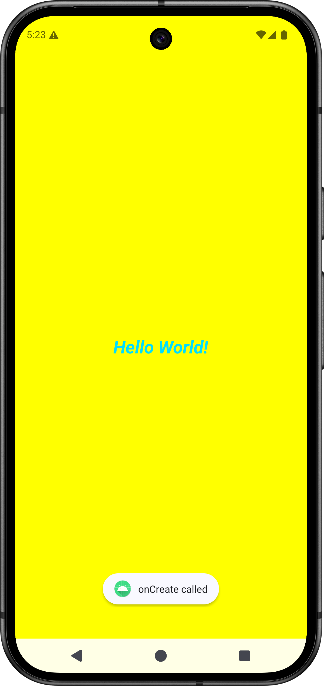
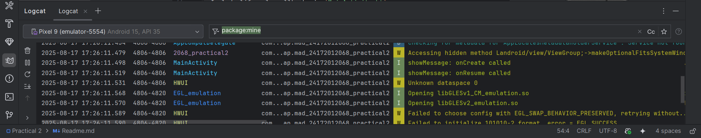

# Practical-2: Activity Lifecycle & Basic UI Demonstration

##  Project Overview
This Android application showcases the **Activity Lifecycle** and a basic UI. The main screen displays a "Hello World" `TextView` centered on the screen, with custom styling, along with Log messages, Toasts, and Snackbars for each lifecycle method.

---

##  Features & Requirements
- **Activity Lifecycle**: All lifecycle callbacks (`onCreate`, `onStart`, `onResume`, `onPause`, `onStop`, `onDestroy`, etc.) should:
    - Display a `Toast`
- **UI Design**:
    - Background color: **Yellow** (`android:background="#FFFF00"`)
    - `TextView` in the center displaying **“Hello World”**
    - `TextView` attributes:
        - Text color: **Holo Blue Bright** (`@android:color/holo_blue_bright`)
        - Font size: **27sp**
        - Text style: **Bold & Italic** (`bold|italic`)
- **Layout**: Use `ConstraintLayout`; generate an ID for the `TextView`

---

##  Table of Contents
1. [Setup Instructions](#setup-instructions)
2. [Project Structure](#project-structure)
3. [Usage](#usage)
4. [Screenshots](#screenshots)
5. [Further Notes](#further-notes)

---

##  Setup Instructions
1. Clone or download this project.
2. Open it in **Android Studio**.
3. Run the app on an emulator or physical device.
4. Observe:
    - The styled "Hello World" `TextView`
    - Lifecycle callbacks in `Logcat`
    - Toast messages as each lifecycle method is triggered


---

##  Usage
- Launch the app.
- Perform actions such as:
    - Launching the activity
    - Pressing Home or switching apps
    - Returning to the app
- Watch for:
    - **Logcat** entries for each lifecycle method
    - **Toasts** and **Snackbars** displaying lifecycle events  
      (E.g.: `"onPause called"` appears via both a Toast and a Snackbar)

---

##  Screenshots
Attach your screenshot here (e.g., app screen or Logcat view) to demonstrate the UI or lifecycle logging.


---

##  Further Notes
- Ensure `ConstraintLayout` is used in `activity_main.xml`
- Use `android:id="@+id/textViewHelloWorld"` (or similar) for `TextView`
- Include lifecycle callbacks in `MainActivity.kt`, e.g.:

  ```kotlin
  override fun onStart() {
      super.onStart()
      Log.d(TAG, "onStart called")
      Toast.makeText(this, "onStart", Toast.LENGTH_SHORT).show()
      Snackbar.make(findViewById(R.id.textViewHelloWorld), "onStart", Snackbar.LENGTH_SHORT).show()
  }
  ```

- The design and behavior follow the specified AIM for Practical-2 ([sites.google.com](https://sites.google.com/ganpatuniversity.ac.in/mad/practical-list/practical-2)).
